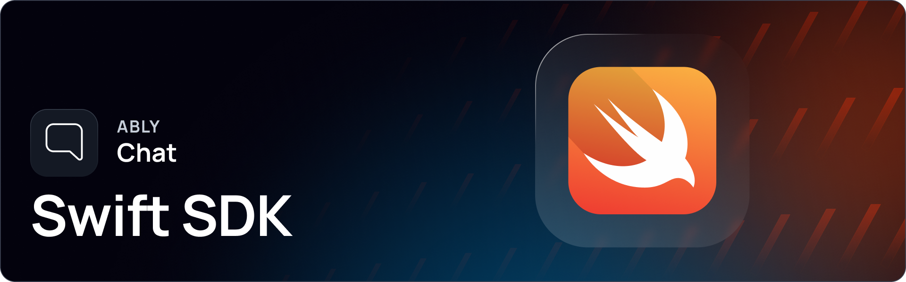

---

# Ably Chat Swift SDK

Ably Chat is a set of purpose-built APIs for a host of chat features enabling you to create 1:1, 1:Many, Many:1 and Many:Many chat rooms for any scale. It is designed to meet a wide range of chat use cases, such as livestreams, in-game communication, customer support, or social interactions in SaaS products. Built on [Ably's](https://ably.com/) core service, it abstracts complex details to enable efficient chat architectures.

---

## Getting started

Everything you need to get started with Ably:

* [Getting started with Ably Chat using Swift.](https://ably.com/docs/chat/getting-started/swift)
* [Ably Chat SDK and usage docs in Swift.](https://ably.com/docs/chat/setup?lang=swift)
* Learn [about Ably Chat.](https://ably.com/docs/chat)
* Play with the [livestream chat demo.](https://ably-livestream-chat-demo.vercel.app/)

---

## Supported platforms

Ably aims to support a wide range of platforms. If you experience any compatibility issues, open an issue in the repository or contact [Ably support](https://ably.com/support).

This SDK supports the following platforms:

| Platform | Support |
|----------|---------|
| iOS      | >= 14.0 |
| macOS    | >= 11.0 |
| tvOS     | >= 14.0 |

> [!NOTE]
> Xcode 16.1 or later is required.

---

## Releases

The [CHANGELOG.md](/CHANGELOG.md) contains details of the latest releases for this SDK. You can also view all Ably releases on [changelog.ably.com](https://changelog.ably.com).

---

## Contribute

Read the [CONTRIBUTING.md](./CONTRIBUTING.md) guidelines to contribute to Ably or [share feedback or request a new feature](https://forms.gle/mBw9M53NYuCBLFpMA).

## Support, feedback and troubleshooting

For help or technical support, visit Ably's [support page](https://ably.com/support). You can also view the [community reported Github issues](https://github.com/ably/ably-chat-swift/issues) or raise one yourself.
